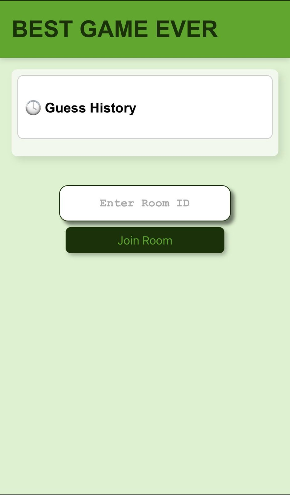
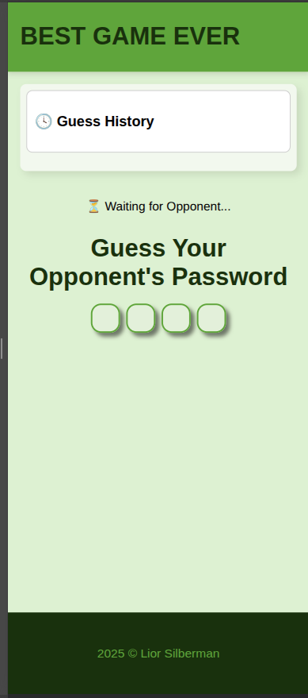
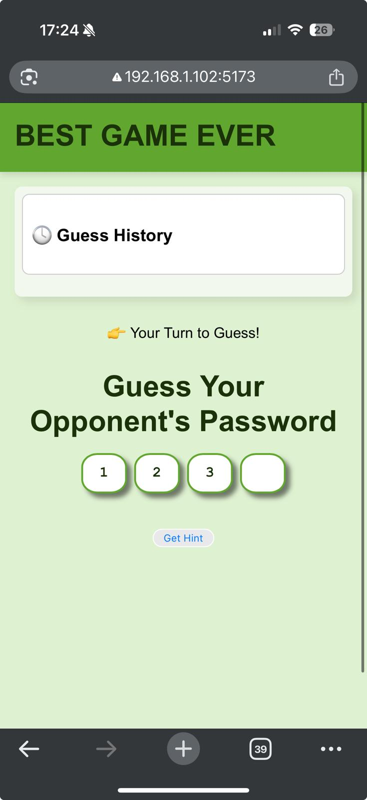
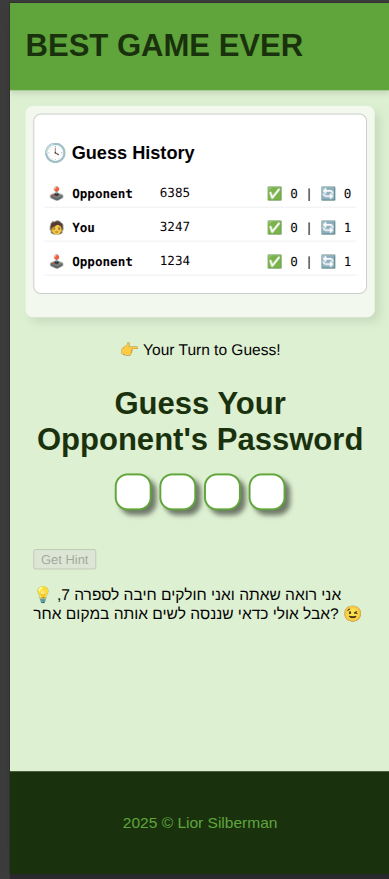
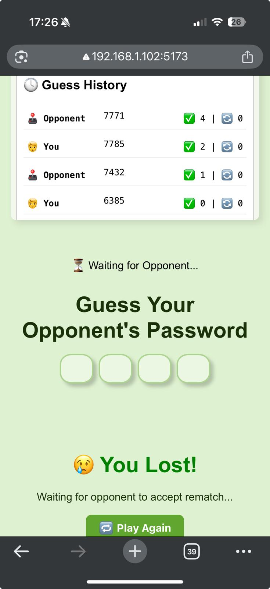
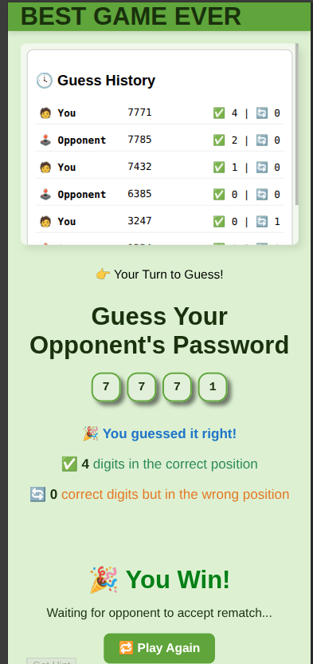

# 🔐 4-Digit Guessing Game

A real-time 2-player web game where players take turns guessing a shared 4-digit password. The game provides feedback on each guess — and even allows one AI-generated hint per player using Gemini!

Built with:
- 🔁 **React + TypeScript** frontend
- 🧠 **Node.js + Socket.IO** backend
- 💡 **Google Gemini API** for AI hints

---

## 🕹️ Gameplay Overview

- Two players join the same room by entering the same **Room ID**.
- A 4-digit password is randomly generated and shared between them.
- Players take turns guessing the password.
- After each guess, they receive feedback:
  - ✅ Correct digits in the correct position
  - 🔄 Correct digits in the wrong position
- Each player can request **one AI-generated hint** during the game.

---

## 🚀 Getting Started

### 1. Clone the repo
```bash
git clone https://github.com/LiorSilberman/web-game.git
cd web-game
```

### 2. Backend Setup
#### Install dependencies
```bash
cd game-backend
npm install
```

#### Create `.env` file
```bash
GEMINI_API_KEY=your_google_generative_ai_key
```

#### Start the server
```bash
node server.js
```

**The backend will run on http://localhost:3001** Or **http://your_ip_address:3001** 


### 3. Frontend Setup
#### Install dependencies
```bash
cd game-frontend
npm install
```

## 💡 Hint System (Gemini API)
**Each player can request one personalized hint during the game. Hints are:**
- Based on the password and the player's guess history.
- Slightly funny, but helpful.
- Generated using Google's Gemini Flash 2.0 model.

## 🧪 Features
- [x] 🔐 Real-time game rooms using WebSocket
- [x] 🕵️ Turn-based password guessing
- [x] 📜 Guess history tracking
- [x] 🤖 One hint per player via Gemini


## 🛠️ Technologies Used
- React with TypeScript
- Node.js + Express
- Socket.IO
- Google Generative AI API (Gemini)
- Vite for fast frontend dev
- CSS for styling

## ✅ TODOs
- [ ] Rematch support (TODO)
- [ ] Add animations and sounds
- [ ] Show game stats after win
- [ ] Add timer and score
- [ ] Deploy to Vercel / Render / Railway

## 📸 Screenshots

<div style="display: flex; flex-wrap: wrap; gap: 20px;">

  <div>
    <p><strong>🏠 Enter Room</strong></p>
    
  </div>

  <div>
    <p><strong>⏳ Waiting for Opponent</strong></p>
    
  </div>

  <div>
    <p><strong>🔢 Guess the Password</strong></p>
    
  </div>

  <div>
    <p><strong>💡 Get Hint from Gemini</strong></p>
    
  </div>

  <div>
    <p><strong>❌ Lost Game Screen</strong></p>
    
  </div>

  <div>
    <p><strong>🏆 Win Game Screen</strong></p>
    
  </div>

</div>

